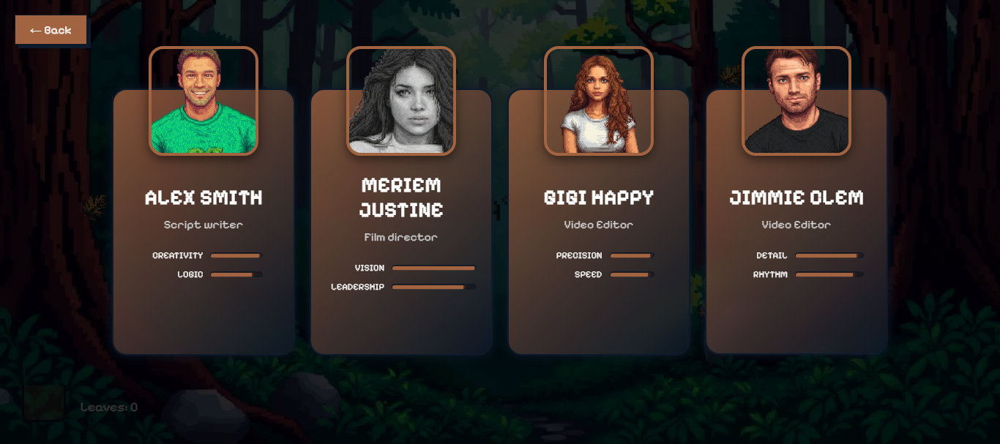
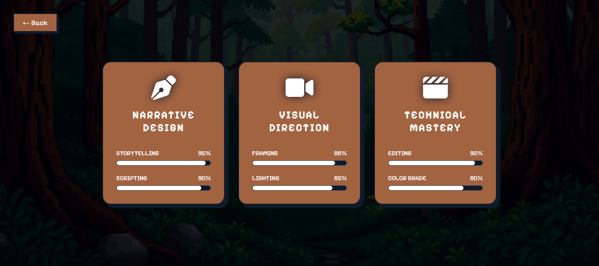
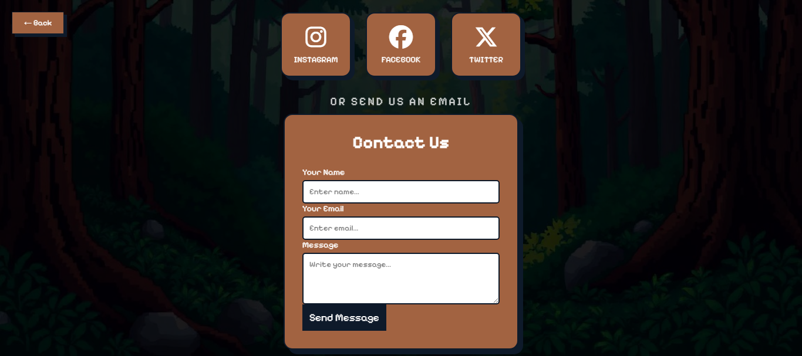

# Project: Creators Portfolio

## Overview

**Creators** is a highly interactive and visually engaging portfolio website designed for a creative agency. It showcases the team's skills in filmmaking, scriptwriting, and video editing through a modern, modular interface.

<video src="https://github.com/user-attachments/assets/48e6c0ea-8ee9-4ed3-96f5-612c9905df25" controls width="600"></video>

## Features

### 1. Custom Loading Experience

The website starts with a professional loading screen that mimics a production slate, featuring a progress bar to ensure all assets are loaded before the user enters the site.

### 2. Team Profiles (About Us)

The "About Us" section features stylized cards for each team member. It uses a "stat-bar" system to visually represent the strengths of each creator (e.g., Creativity, Logic, Precision).

### 3. Agency Services

Our services are categorized into three main pillars:

- **Narrative Design**: Storytelling and Scripting.
- **Visual Direction**: Framing and Lighting.
- **Technical Mastery**: Editing and Color Grading.

Each service is accompanied by a skill-tree style progress bar.

### 4. Contact & Social Integration

A dedicated contact hub where clients can reach out via a custom form or connect through social media platforms like Instagram, Facebook, and X.

### 5. Interactive Leaf Game

To add a layer of engagement, the site includes a mini-game where users collect falling leaves in a basket, tracked by a real-time score counter.

## Technical Implementation

### Architecture

The project follows a modular structure for both CSS and JavaScript to ensure maintainability:

- `css styles/components/`: Individual stylesheets for each section (nav, card, contact, etc.).
- `js/`: Separate logic files for navigation, game mechanics, and loader.

### Tech Stack

- **HTML5**: Semantic structure.
- **CSS3**: Advanced layouts, custom animations, and responsive design.
- **JavaScript**: DOM manipulation, game logic, and state management for section switching.
- **External Assets**: Font Awesome for icons and Google Fonts for a unique "Pixelify" aesthetic.

## Future Enhancements

- **Responsive Design**: Ensure optimal performance and layout on mobile devices and various screen sizes.
- **Performance Optimization**: Minify assets and implement lazy loading for faster initial load times.
- **Accessibility Improvements**: Add ARIA labels, keyboard navigation.

## How to Run

1. Clone the repository.
2. Open `index.html` in any modern web browser.
